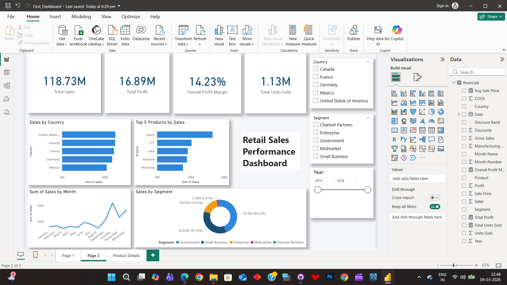

📊 Retail Sales Performance Dashboard (Power BI)
📌 Project Overview

This project presents a Retail Sales Performance Dashboard built using Microsoft Power BI.
The dashboard helps analyze sales performance across countries, products, segments, and time periods.

It provides key insights into revenue, profit margins, and product performance to support data-driven business decisions.

🖼 Dashboard Preview

📈 Key Metrics

The dashboard tracks the following important business metrics:

Total Sales

Total Profit

Overall Profit Margin

Total Units Sold

These KPIs help evaluate the overall performance of the retail business.

📊 Dashboard Features

The dashboard includes the following visualizations:

Sales by Country – Identifies top performing regions

Top 5 Products by Sales – Highlights best selling products

Monthly Sales Trend – Shows sales growth over time

Sales by Segment – Analyzes sales distribution across customer segments

Interactive filters (slicers) allow users to analyze data by:

Country

Segment

Year

🧮 DAX Measures Used

Some key DAX measures used in the dashboard:

Total Sales = SUM(financials[Sales])

Total Profit = SUM(financials[Profit])

Profit Margin = 
DIVIDE(
    SUM(financials[Profit]),
    SUM(financials[Sales])
)

🛠 Tools & Technologies

Power BI Desktop

DAX (Data Analysis Expressions)

Data Visualization

Data Modeling

📂 Project Files
retail-sales-dashboard.pbix
dashboard-preview.png
README.md

🎯 Skills Demonstrated

This project demonstrates the following data analytics skills:

Data Visualization

Dashboard Design

Business Insights

DAX Calculations

Interactive Reporting

👤 Author

Amit Roy

Aspiring Data Analyst | Power BI | SQL | Data Visualization